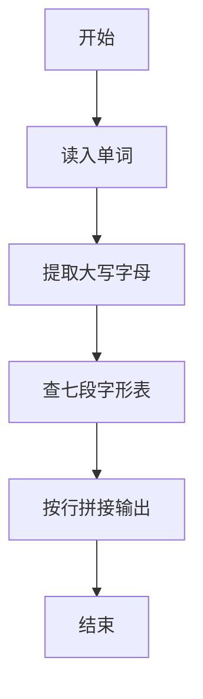
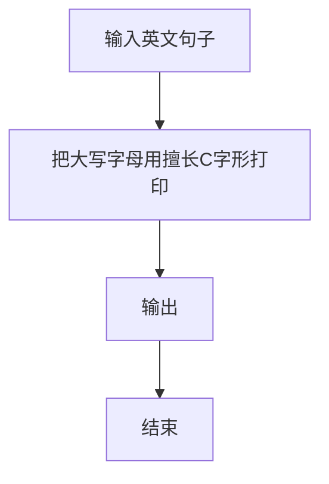

# 1109 擅长C

- **分值：** 20分

### 题目描述

当你被面试官要求用 C 写一个“Hello World”时，有本事像下图显示的那样写一个出来吗？


### 输入格式：

输入首先给出 26 个英文大写字母 A-Z，每个字母用一个 $7\times 5$ 的、由 `C` 和 `.` 组成的矩阵构成。最后在一行中给出一个句子，以回车结束。句子是由若干个单词（每个包含不超过 10 个连续的大写英文字母）组成的，单词间以任何非大写英文字母分隔。

题目保证至少给出一个单词。

### 输出格式：

对每个单词，将其每个字母用矩阵形式在一行中输出，字母间有一列空格分隔。单词的首尾不得有多余空格。

相邻的两个单词间必须有一空行分隔。输出的首尾不得有多余空行。

### 输入样例：
```
..C..
.C.C.
C...C
CCCCC
C...C
C...C
C...C
CCCC.
C...C
C...C
CCCC.
C...C
C...C
CCCC.
.CCC.
C...C
C....
C....
C....
C...C
.CCC.
CCCC.
C...C
C...C
C...C
C...C
C...C
CCCC.
CCCCC
C....
C....
CCCC.
C....
C....
CCCCC
CCCCC
C....
C....
CCCC.
C....
C....
C....
CCCC.
C...C
C....
C.CCC
C...C
C...C
CCCC.
C...C
C...C
C...C
CCCCC
C...C
C...C
C...C
CCCCC
..C..
..C..
..C..
..C..
..C..
CCCCC
CCCCC
....C
....C
....C
....C
C...C
.CCC.
C...C
C..C.
C.C..
CC...
C.C..
C..C.
C...C
C....
C....
C....
C....
C....
C....
CCCCC
C...C
C...C
CC.CC
C.C.C
C...C
C...C
C...C
C...C
C...C
CC..C
C.C.C
C..CC
C...C
C...C
.CCC.
C...C
C...C
C...C
C...C
C...C
.CCC.
CCCC.
C...C
C...C
CCCC.
C....
C....
C....
.CCC.
C...C
C...C
C...C
C.C.C
C..CC
.CCC.
CCCC.
C...C
CCCC.
CC...
C.C..
C..C.
C...C
.CCC.
C...C
C....
.CCC.
....C
C...C
.CCC.
CCCCC
..C..
..C..
..C..
..C..
..C..
..C..
C...C
C...C
C...C
C...C
C...C
C...C
.CCC.
C...C
C...C
C...C
C...C
C...C
.C.C.
..C..
C...C
C...C
C...C
C.C.C
CC.CC
C...C
C...C
C...C
C...C
.C.C.
..C..
.C.C.
C...C
C...C
C...C
C...C
.C.C.
..C..
..C..
..C..
..C..
CCCCC
....C
...C.
..C..
.C...
C....
CCCCC
HELLO~WORLD!
```

### 输出样例：
```
C...C CCCCC C.... C.... .CCC.
C...C C.... C.... C.... C...C
C...C C.... C.... C.... C...C
CCCCC CCCC. C.... C.... C...C
C...C C.... C.... C.... C...C
C...C C.... C.... C.... C...C
C...C CCCCC CCCCC CCCCC .CCC.

C...C .CCC. CCCC. C.... CCCC.
C...C C...C C...C C.... C...C
C...C C...C CCCC. C.... C...C
C.C.C C...C CC... C.... C...C
CC.CC C...C C.C.. C.... C...C
C...C C...C C..C. C.... C...C
C...C .CCC. C...C CCCCC CCCC.
```


### 解题思路

本题的核心是：解析句子中的单词，提取大写字母并映射到七段字形输出。程序先读取题目输入，再按照上述规则完成数据处理，最后严格按照题目要求输出结果。实现时应优先根据题目约束选择合适的数据类型和数据结构，避免溢出或不必要的重复计算。

时间复杂度为 O(L)；空间复杂度取决于输入规模，主要用于保存题目数据和中间结果。

### 代码流程说明

1. 读入单词列表。
2. 取每个单词的大写字母。
3. 用字形模板竖向打印。

### 代码实现

```ruby
# 题目：1109-擅长C
# 实现原理：
# 本题的核心是：解析句子中的单词，提取大写字母并映射到七段字形输出
# 时间复杂度为 O(L)；空间复杂度取决于输入规模，主要用于保存题目数据和中间结果。
# 代码步骤：
# 1. 读取输入并初始化必要的数据结构。
# 2. 按题意完成核心计算，处理边界情况。
# 3. 按题目要求格式化并输出结果。
#
lines = STDIN.readlines.map(&:chomp)
grid = lines.first(26 * 7).each_slice(7).map { |row| row.map(&:strip) }
words = lines.last.scan(/[A-Z]+/)
blocks = words.map do |word|
  (0...7).map do |row|
    word.each_char.map { |char| grid[char.ord - "A".ord][row] }.join(" ")
  end
end
puts blocks.map { |block| block.join("\n") }.join("\n\n")
```

### 代码流程图



### 解题流程图



### 常见易错点

- 字形表共 7 行，行间不要空行。
- 单词无大写时如何处理按题面。
- 字母间距按模板。
