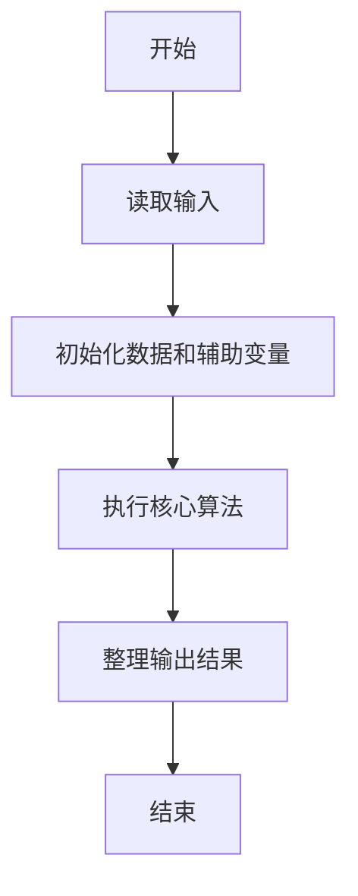
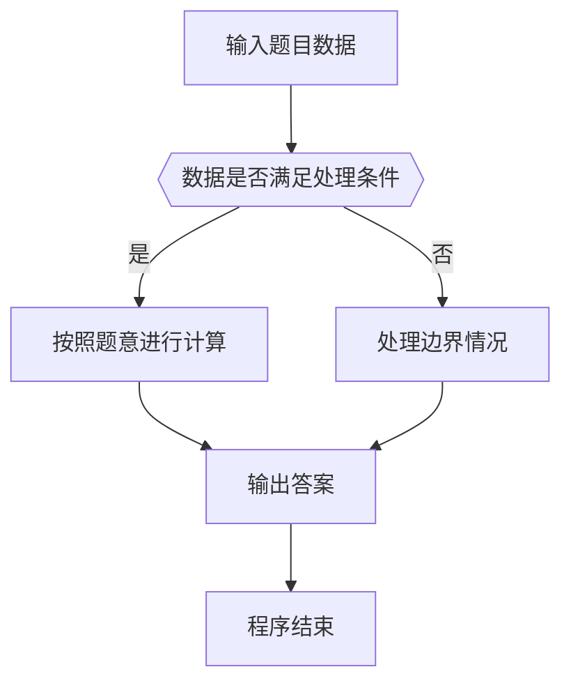

# 1110 区块反转

- **分值：** 25分

### 题目描述

给定一个单链表 $L$，我们将每 $K$ 个结点看成一个**区块**（链表最后若不足 $K$ 个结点，也看成一个区块），请编写程序将 $L$ 中所有区块的链接反转。例如：给定 $L$ 为 1→2→3→4→5→6→7→8，$K$ 为 3，则输出应该为 7→8→4→5→6→1→2→3。

### 输入格式：

每个输入包含 1 个测试用例。每个测试用例第 1 行给出第 1 个结点的地址、结点总个数正整数 $N$（$N\le 10^5$）、以及正整数 $K$（$K\le N$），即区块的大小。结点的地址是 5 位非负整数，NULL 地址用 $-1$ 表示。

接下来有 $N$ 行，每行格式为：
```
Address Data Next
```

其中 `Address` 是结点地址，`Data` 是该结点保存的整数数据，`Next` 是下一结点的地址。

### 输出格式：

对每个测试用例，顺序输出反转后的链表，其上每个结点占一行，格式与输入相同。

### 输入样例：
```
00100 8 3
71120 7 88666
00000 4 99999
00100 1 12309
68237 6 71120
33218 3 00000
99999 5 68237
88666 8 -1
12309 2 33218
```

### 输出样例：
```
71120 7 88666
88666 8 00000
00000 4 99999
99999 5 68237
68237 6 00100
00100 1 12309
12309 2 33218
33218 3 -1
```


### 解题思路

本题的核心是：每 K 个节点作为一组原地反转，剩余不足 K 个的节点保持不变。程序先读取题目输入，再按照上述规则完成数据处理，最后严格按照题目要求输出结果。实现时应优先根据题目约束选择合适的数据类型和数据结构，避免溢出或不必要的重复计算。

时间复杂度为 O(n)；空间复杂度取决于输入规模，主要用于保存题目数据和中间结果。

### 代码流程说明

1. 读取 1110 区块反转 所需的输入数据。
2. 初始化计数器、数组或其他辅助变量。
3. 每 K 个节点作为一组原地反转，剩余不足 K 个的节点保持不变。
4. 按题目规定的格式输出计算结果。

### 代码实现

```ruby
# 题目：1110-区块反转
# 实现原理：
# 本题的核心是：每 K 个节点作为一组原地反转，剩余不足 K 个的节点保持不变。程序先读取题目输入，再按照上述规则完成数据处理，最后严格按照题目要求输出结果。实现时应优先根据题目约束选择合适的数据类型和数据结构，避免溢出或不必要的重复计算。
# 时间复杂度为 O(n)；空间复杂度取决于输入规模，主要用于保存题目数据和中间结果。
# 代码步骤：
# 1. 读取输入并初始化必要的数据结构。
# 2. 按题意完成核心计算，处理边界情况。
# 3. 按题目要求格式化并输出结果。
#
tokens = STDIN.read.split
head, count, group = tokens.shift(3)
values = {}
next_nodes = {}
count.to_i.times do
  address, value, next_address = tokens.shift(3)
  values[address] = value
  next_nodes[address] = next_address
end
order = []
current = head
while current != "-1"
  order << current
  current = next_nodes[current]
end
order = order.each_slice(group.to_i).to_a.reverse.flatten
order.each_with_index { |address, i| puts "#{address} #{values[address]} #{i + 1 == order.length ? '-1' : order[i + 1]}" }
```

### 代码流程图



### 解题流程图



### 常见易错点

- 注意输入数据的范围，选择足够大的整数类型，并正确处理边界值。
- 循环、数组下标和字符串结束位置要严格对应题目定义，避免越界。
- 输出格式必须与题目要求完全一致，包括空格、换行、大小写和特殊符号。
- 如果存在排序、去重、进位、约分或四舍五入等操作，应在输出前统一完成。
