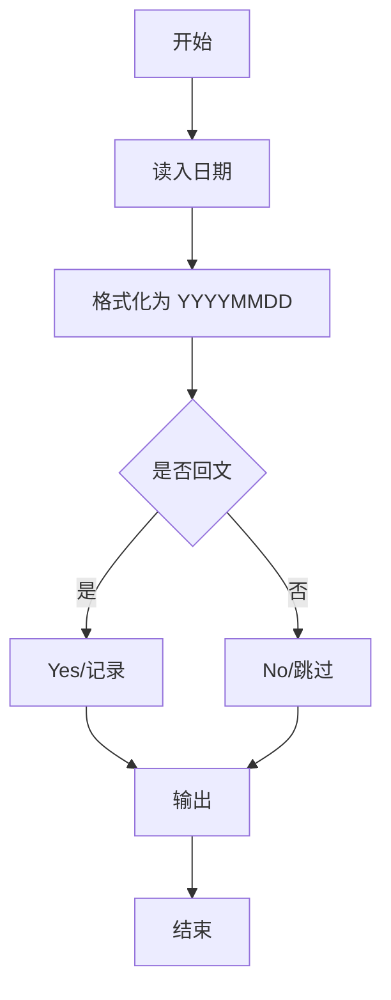
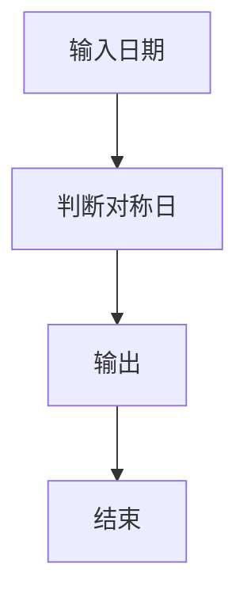

# 1111 对称日

- **分值：** 15分

### 题目描述


央视新闻发了一条微博，指出 2020 年有个罕见的“对称日”，即 2020 年 2 月 2 日，按照 `年年年年月月日日` 格式组成的字符串 20200202 是完全对称的。

给定任意一个日期，本题就请你写程序判断一下，这是不是一个对称日？

### 输入格式：

输入首先在第一行给出正整数 $N$（$1 < N \le 10$）。随后 $N$ 行，每行给出一个日期，却是按英文习惯的格式：`Month Day, Year`。其中 `Month` 是月份的缩写，对应如下：

- 一月：Jan
- 二月：Feb
- 三月：Mar
- 四月：Apr
- 五月：May
- 六月：Jun
- 七月：Jul
- 八月：Aug
- 九月：Sep
- 十月：Oct
- 十一月：Nov
- 十二月：Dec

`Day` 是月份中的日期，为 $[1,31]$ 区间内的整数；`Year` 是年份，为 $[1,9999]$ 区间内的整数。

### 输出格式：

对每一个给定的日期，在一行中先输出 `Y` 如果这是一个对称日，否则输出 `N`；随后空一格，输出日期对应的 `年年年年月月日日` 格式组成的字符串。

### 输入样例：
```
5
Feb 2, 2020
Mar 7, 2020
Oct 10, 101
Nov 21, 1211
Dec 29, 1229
```

### 输出样例：
```
Y 20200202
N 20200307
Y 01011010
Y 12111121
N 12291229
```


### 解题思路

本题的核心是：将日期转换为 YYYYMMDD 字符串，检查字符串两端字符是否对称。程序先读取题目输入，再按照上述规则完成数据处理，最后严格按照题目要求输出结果。实现时应优先根据题目约束选择合适的数据类型和数据结构，避免溢出或不必要的重复计算。

时间复杂度为 O(N)；空间复杂度为 O(1)。

### 代码流程说明

1. 读入日期范围或单个日期。
2. 判断 YYYYMMDD 是否回文。
3. 按要求输出对称日。

### 代码实现

```ruby
# 题目：1111-对称日
# 实现原理：
# 本题的核心是：将日期转换为 YYYYMMDD 字符串，检查字符串两端字符是否对称
# 时间复杂度为 O(N)；空间复杂度为 O(1)。
# 代码步骤：
# 1. 读取输入并初始化必要的数据结构。
# 2. 按题意完成核心计算，处理边界情况。
# 3. 按题目要求格式化并输出结果。
#
tokens = STDIN.read.split
count = tokens.shift.to_i
months = %w[Jan Feb Mar Apr May Jun Jul Aug Sep Oct Nov Dec]
count.times do
  month, day, year = tokens.shift(3)
  date = format("%04d%02d%02d", year.to_i, months.index(month) + 1, day.delete(",").to_i)
  puts "#{date == date.reverse ? 'Y' : 'N'} #{date}"
end
```

### 代码流程图



### 解题流程图



### 常见易错点

- 保持 8 位字符串比较，前导零不丢。
- 注意闰年日期合法性。
- 范围查询时逐日判断。
