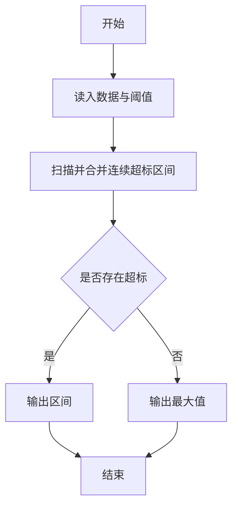
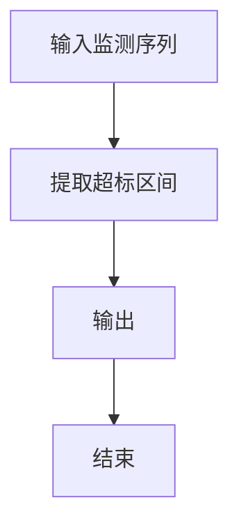

# 1112 超标区间

- **分值：** 20分

### 题目描述


上图是用某科学研究中采集的数据绘制成的折线图，其中红色横线表示正常数据的阈值（在此图中阈值是 25）。你的任务就是把超出阈值的非正常数据所在的区间找出来。例如上图中横轴 [3, 5] 区间中的 3 个数据点超标，横轴上点 9 （可以表示为区间 [9, 9]）对应的数据点也超标。

### 输入格式：

输入第一行给出两个正整数 $N$（$\le 10^4$）和 $T$（$\le 100$），分别是数据点的数量和阈值。第二行给出 $N$ 个数据点的纵坐标，均为不超过 1000 的正整数，对应的横坐标为整数 0 到 $N-1$。

### 输出格式：

按从左到右的顺序输出超标数据的区间，每个区间占一行，格式为 `[A, B]`，其中 `A` 和 `B` 为区间的左右端点。如果没有数据超标，则在一行中输出所有数据的最大值。

### 输入样例 1：
```
11 25
21 15 25 28 35 27 20 24 18 32 23
```

### 输出样例 1：
```
[3, 5]
[9, 9]
```

### 输入样例 2：
```
11 40
21 15 25 28 35 27 20 24 18 32 23
```

### 输出样例 2：
```
35
```


### 解题思路

本题的核心是：扫描数据点，合并连续超过阈值的下标区间；若没有超标区间则维护最大值。程序先读取题目输入，再按照上述规则完成数据处理，最后严格按照题目要求输出结果。实现时应优先根据题目约束选择合适的数据类型和数据结构，避免溢出或不必要的重复计算。

时间复杂度为 O(n)；空间复杂度取决于输入规模，主要用于保存题目数据和中间结果。

### 代码流程说明

1. 读入序列与阈值。
2. 标记连续超阈值区间。
3. 输出区间或最大值。

### 代码实现

```ruby
# 题目：1112-超标区间
# 实现原理：
# 本题的核心是：扫描数据点，合并连续超过阈值的下标区间；若没有超标区间则维护最大值
# 时间复杂度为 O(n)；空间复杂度取决于输入规模，主要用于保存题目数据和中间结果。
# 代码步骤：
# 1. 读取输入并初始化必要的数据结构。
# 2. 按题意完成核心计算，处理边界情况。
# 3. 按题目要求格式化并输出结果。
#
tokens = STDIN.read.split.map(&:to_i)
count, threshold = tokens.shift(2)
values = tokens.first(count)
ranges = []
start = nil
values.each_with_index do |value, i|
  start = i if value > threshold && start.nil?
  if value <= threshold && start
    ranges << "[#{start}, #{i - 1}]"
    start = nil
  end
end
ranges << "[#{start}, #{count - 1}]" if start
puts ranges.empty? ? values.max : ranges.join("\n")
```

### 代码流程图



### 解题流程图



### 常见易错点

- 区间用连续下标表示。
- 单点也可成为区间。
- 无超标时输出的是最大值。
