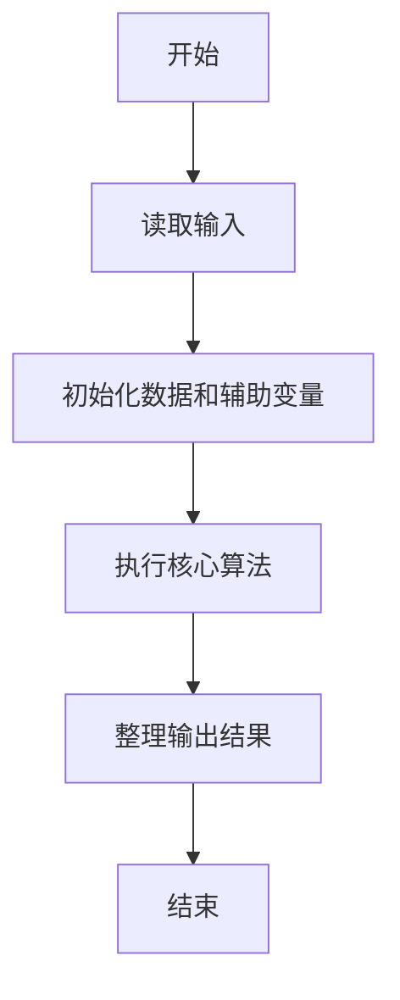
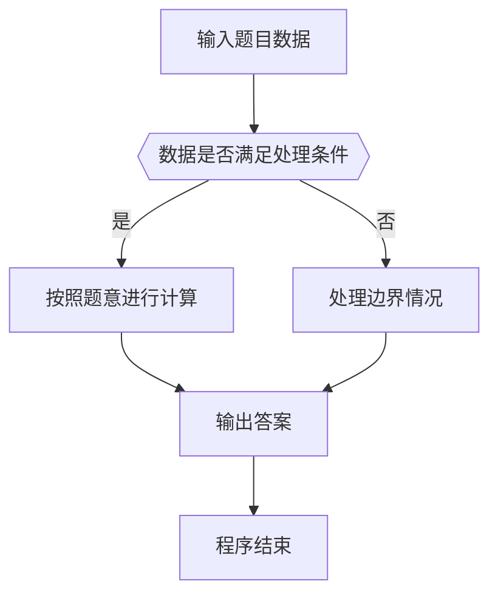

# 1113 钱串子的加法

- **分值：** 20分

### 题目描述


人类习惯用 10 进制，可能因为大多数人类有 10 根手指头，可以用于计数。这个世界上有一种叫“钱串子”（学名“蚰蜒”）的生物，有 30 只细长的手/脚，在它们的世界里，数字应该是 30 进制的。本题就请你实现钱串子世界里的加法运算。

### 输入格式：

输入在一行中给出两个钱串子世界里的非负整数，其间以空格分隔。

所谓“钱串子世界里的整数”是一个 30 进制的数字，其数字 0 到 9 跟人类世界的整数一致，数字 10 到 29 用小写英文字母 a 到 t 顺次表示。

输入给出的两个整数都不超过 $10^5$ 位。

### 输出格式：

在一行中输出两个整数的和。注意结果数字不得有前导零。

### 输入样例：
```
2g50ttaq 0st9hk381
```

### 输出样例：
```
11feik2ir
```


### 解题思路

本题的核心是：从低位到高位按三十进制逐位相加，并处理进位。程序先读取题目输入，再按照上述规则完成数据处理，最后严格按照题目要求输出结果。实现时应优先根据题目约束选择合适的数据类型和数据结构，避免溢出或不必要的重复计算。

时间复杂度为 O(L)；空间复杂度取决于输入规模，主要用于保存题目数据和中间结果。

### 代码流程说明

1. 读取 1113 钱串子的加法 所需的输入数据。
2. 初始化计数器、数组或其他辅助变量。
3. 从低位到高位按三十进制逐位相加，并处理进位。
4. 按题目规定的格式输出计算结果。

### 代码实现

```ruby
# 题目：1113-钱串子的加法
# 实现原理：
# 本题的核心是：从低位到高位按三十进制逐位相加，并处理进位。程序先读取题目输入，再按照上述规则完成数据处理，最后严格按照题目要求输出结果。实现时应优先根据题目约束选择合适的数据类型和数据结构，避免溢出或不必要的重复计算。
# 时间复杂度为 O(L)；空间复杂度取决于输入规模，主要用于保存题目数据和中间结果。
# 代码步骤：
# 1. 读取输入并初始化必要的数据结构。
# 2. 按题意完成核心计算，处理边界情况。
# 3. 按题目要求格式化并输出结果。
#
first, second = STDIN.read.split.map(&:chars)
value = ->(digit) { digit <= "9" ? digit.to_i : digit.ord - "a".ord + 10 }
digit = ->(number) { number < 10 ? number.to_s : ("a".ord + number - 10).chr }
i = first.length - 1
j = second.length - 1
carry = 0
result = []
while i >= 0 || j >= 0 || carry.positive?
  sum = carry + (i >= 0 ? value.call(first[i]) : 0) + (j >= 0 ? value.call(second[j]) : 0)
  result << digit.call(sum % 30)
  carry = sum / 30
  i -= 1
  j -= 1
end
puts result.reverse.join
```

### 代码流程图



### 解题流程图



### 常见易错点

- 注意输入数据的范围，选择足够大的整数类型，并正确处理边界值。
- 循环、数组下标和字符串结束位置要严格对应题目定义，避免越界。
- 输出格式必须与题目要求完全一致，包括空格、换行、大小写和特殊符号。
- 如果存在排序、去重、进位、约分或四舍五入等操作，应在输出前统一完成。
