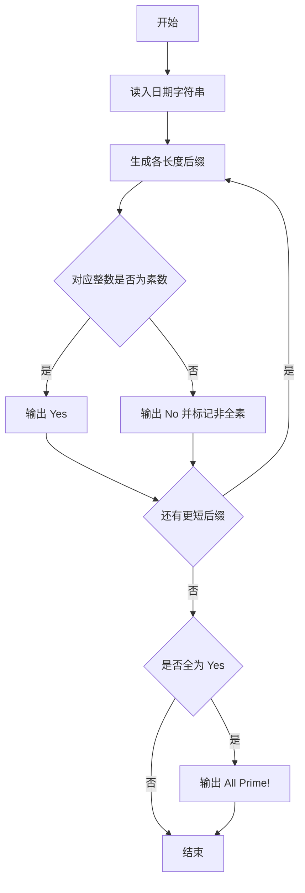
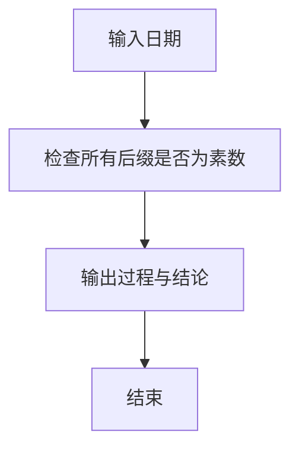

# 1114 全素日

- **分值：** 20分

### 题目描述


以上图片来自新浪微博，展示了一个非常酷的“全素日”：2019年5月23日。即不仅`20190523`本身是个素数，它的任何以末尾数字`3`结尾的子串都是素数。

本题就请你写个程序判断一个给定日期是否是“全素日”。

### 输入格式：

输入按照 `yyyymmdd` 的格式给出一个日期。题目保证日期在0001年1月1日到9999年12月31日之间。

### 输出格式：

从原始日期开始，按照子串长度递减的顺序，每行首先输出一个子串和一个空格，然后输出 `Yes`，如果该子串对应的数字是一个素数，否则输出 `No`。如果这个日期是一个全素日，则在最后一行输出 `All Prime!`。

### 输入样例 1：
```
20190523
```

### 输出样例 1：
```
20190523 Yes
0190523 Yes
190523 Yes
90523 Yes
0523 Yes
523 Yes
23 Yes
3 Yes
All Prime!
```

### 输入样例 2：
```
20191231
```

### 输出样例 2：
```
20191231 Yes
0191231 Yes
191231 Yes
91231 No
1231 Yes
231 No
31 Yes
1 No
```


### 解题思路

本题的核心是：从日期字符串的每个后缀生成子串，判断对应整数是否为素数。程序先读取题目输入，再按照上述规则完成数据处理，最后严格按照题目要求输出结果。实现时应优先根据题目约束选择合适的数据类型和数据结构，避免溢出或不必要的重复计算。

时间复杂度为 O(L²√V)；空间复杂度取决于输入规模，主要用于保存题目数据和中间结果。

### 代码流程说明

1. 读入 yyyymmdd 字符串。
2. 从最长后缀到最短后缀依次判断素数。
3. 输出每个后缀的 Yes/No，全 Yes 时追加 All Prime!

### 代码实现

```ruby
# 题目：1114-全素日
# 实现原理：见正文「解题思路」。
# 代码步骤：
# 1. 读取输入。
# 2. 按题意完成核心计算。
# 3. 按题目要求输出结果。
#
text = STDIN.read.strip
prime = ->(n) { n >= 2 && (2..Math.sqrt(n).to_i).none? { |d| (n % d).zero? } }
all_ok = true
(0...text.length).each do |i|
  suffix = text[i..]
  ok = prime.call(suffix.to_i)
  all_ok = false unless ok
  puts "#{suffix} #{ok ? 'Yes' : 'No'}"
end
puts "All Prime!" if all_ok
```

### 代码流程图



### 解题流程图



### 常见易错点

- 后缀保留原字符串形式（可含前导 0）。
- 素数判断看转成整数后的值。
- 1 和 0 都不是素数。
