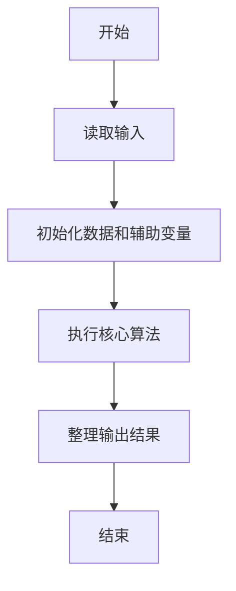
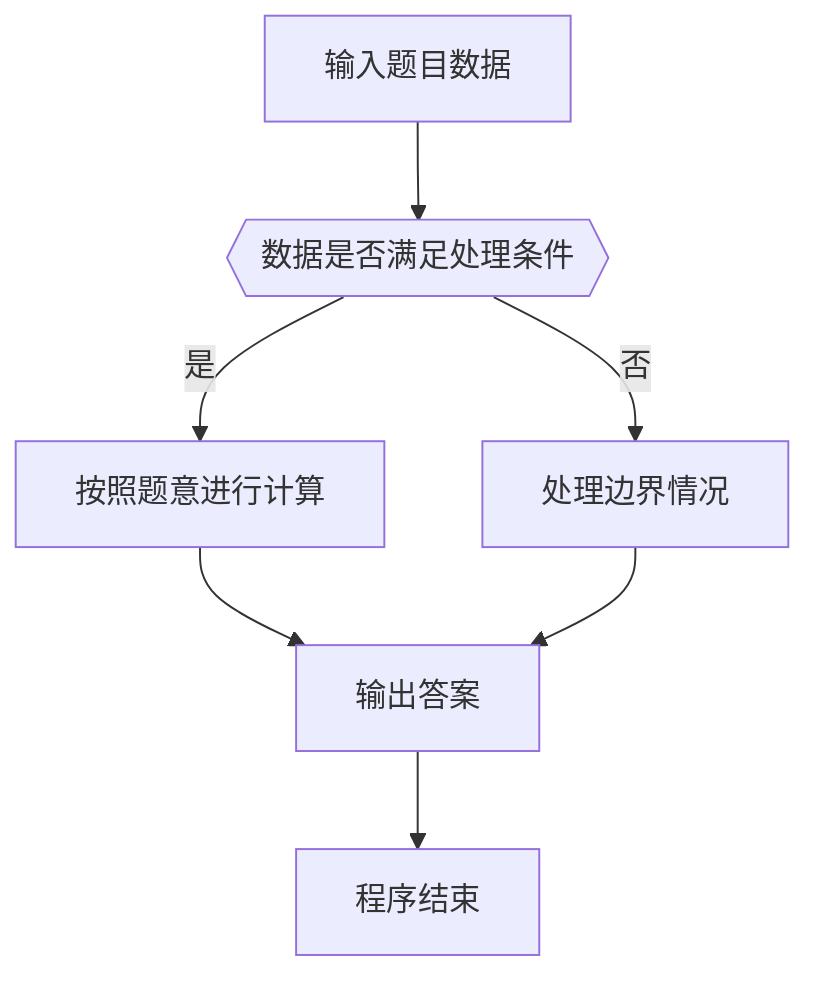

# 1115 裁判机

- **分值：** 25分

### 题目描述

有一种数字游戏的规则如下：首先由裁判给定两个不同的正整数，然后参加游戏的几个人轮流给出正整数。要求给出的数字必须是前面已经出现的某两个正整数之差，且不能等于之前的任何一个数。游戏一直持续若干轮，中间有写重复或写错的人就出局。

本题要求你实现这个游戏的裁判机，自动判断每位游戏者给出的数字是否合法，以及最后的赢家。

### 输入格式：

输入在第一行中给出 2 个初始的正整数，保证都在 $[1, 10^5]$ 范围内且不相同。

第二行依次给出参加比赛的人数 $N$（$2\le N\le 10$）和每个人都要经历的轮次数 $M$（$2\le M\le 10^3$）。

以下 $N$ 行，每行给出 $M$ 个正整数。第 $i$ 行对应第 $i$ 个人给出的数字（$i=1, \cdots , N$）。游戏顺序是从第 1 个人给出第 1 个数字开始，每人顺次在第 1 轮给出自己的第 1 个数字；然后每人顺次在第 2 轮给出自己的第 2 个数字，以此类推。

### 输出格式：

如果在第 `k` 轮，第 `i` 个人出局，就在一行中输出 `Round #k: i is out.`。出局人后面给出的数字不算；同一轮出局的人按编号增序输出。直到最后一轮结束，在一行中输出 `Winner(s): W1 W2 ... Wn`，其中 `W1 ... Wn` 是最后的赢家编号，按增序输出。数字间以 1 个空格分隔，行末不得有多余空格。如果没有赢家，则输出 `No winner.`。

### 输入样例 1：
```
101 42
4 5
59 34 67 9 7
17 9 8 50 7
25 92 43 26 37
76 51 1 41 40
```

### 输出样例 1：
```
Round #4: 1 is out.
Round #5: 3 is out.
Winner(s): 2 4
```

### 输入样例 2：
```
42 101
4 5
59 34 67 9 7
17 9 18 50 49
25 92 58 1 39
102 32 2 6 41
```

### 输出样例 2：
```
Round #1: 4 is out.
Round #3: 2 is out.
Round #4: 1 is out.
Round #5: 3 is out.
No winner.
```


### 解题思路

本题的核心是：按轮次和玩家顺序验证数字是否是此前两个数的差且未重复，淘汰不合法玩家。程序先读取题目输入，再按照上述规则完成数据处理，最后严格按照题目要求输出结果。实现时应优先根据题目约束选择合适的数据类型和数据结构，避免溢出或不必要的重复计算。

时间复杂度为 O((NM)³)；空间复杂度为 O((NM)²)。

### 代码流程说明

1. 读取 1115 裁判机 所需的输入数据。
2. 初始化计数器、数组或其他辅助变量。
3. 按轮次和玩家顺序验证数字是否是此前两个数的差且未重复，淘汰不合法玩家。
4. 按题目规定的格式输出计算结果。

### 代码实现

```ruby
# 题目：1115-裁判机
# 实现原理：
# 本题的核心是：按轮次和玩家顺序验证数字是否是此前两个数的差且未重复，淘汰不合法玩家。程序先读取题目输入，再按照上述规则完成数据处理，最后严格按照题目要求输出结果。实现时应优先根据题目约束选择合适的数据类型和数据结构，避免溢出或不必要的重复计算。
# 时间复杂度为 O((NM)³)；空间复杂度为 O((NM)²)。
# 代码步骤：
# 1. 读取输入并初始化必要的数据结构。
# 2. 按题意完成核心计算，处理边界情况。
# 3. 按题目要求格式化并输出结果。
#
tokens = STDIN.read.split.map(&:to_i)
first, second, players, rounds = tokens.shift(4)
matrix = tokens.each_slice(rounds).first(players)
alive = Array.new(players, true)
values = [first, second]
seen = values.tally
rounds.times do |round|
  players.times do |player|
    next unless alive[player]
    value = matrix[player][round]
    valid = values.combination(2).any? { |a, b| (a - b).abs == value } && !seen[value]
    if valid
      values << value
      seen[value] = true
    else
      alive[player] = false
      puts "Round ##{round + 1}: #{player + 1} is out."
    end
  end
end
winners = alive.each_index.select { |i| alive[i] }.map { |i| i + 1 }
puts winners.empty? ? "No winner." : "Winner(s):#{winners.join(' ')}"
```

### 代码流程图



### 解题流程图



### 常见易错点

- 注意输入数据的范围，选择足够大的整数类型，并正确处理边界值。
- 循环、数组下标和字符串结束位置要严格对应题目定义，避免越界。
- 输出格式必须与题目要求完全一致，包括空格、换行、大小写和特殊符号。
- 如果存在排序、去重、进位、约分或四舍五入等操作，应在输出前统一完成。
