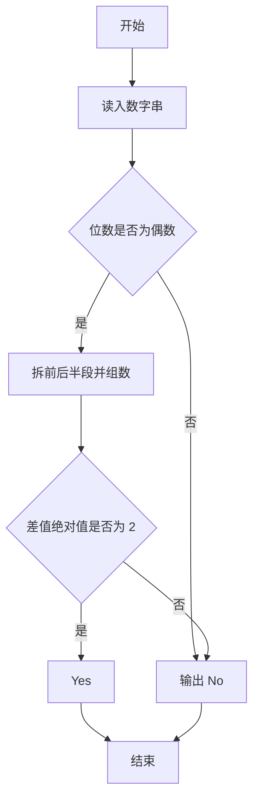
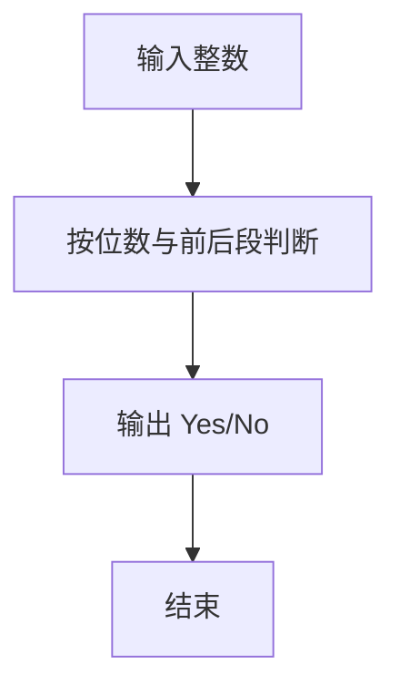

# 1116 多二了一点

- **分值：** 15分

### 题目描述

若一个正整数有 $2n$ 个数位，后 $n$ 个数位组成的数恰好比前 $n$ 个数位组成的数多 2，则称这个数字“多二了一点”。如 24、6668、233235 等都是多二了一点的数字。
给定任一正整数，请你判断它有没有多二了那么一点。

### 输入格式：
输入在第一行中给出一个正整数 $N$（$\le 10^{1000}$）。

### 输出格式：
在一行中根据情况输出下列之一：
- 如果输入的整数没有偶数个数位，输出 `Error: X digit(s)`，其中 `X` 是 $N$ 的位数；
- 如果是偶数位的数字，并且是多二了一点，输出 `Yes: X - Y = 2`，其中 `X` 是后一半数位组成的数，`Y` 是前一半数位组成的数。**注意：为了让题目简单，输入保证此时 `Y` 的个位数不大于 7。**
- 如果是偶数位的数字，但并不是多二了一点，输出 `No: X - Y != 2`，其中 `X` 是后一半数位组成的数，`Y` 是前一半数位组成的数。

### 输入样例 1：
```
233235
```
### 输出样例 1：
```
Yes: 235 - 233 = 2
```
### 输入样例 2：
```
5678912345
```
### 输出样例 2：
```
No: 12345 - 56789 != 2
```
### 输入样例 3：
```
2331235
```
### 输出样例 3：
```
Error: 7 digit(s)
```

**鸣谢彭诗扬修正数据！**


### 解题思路

本题的核心是：检查数字位数是否为偶数，将后半段与前半段比较，判断差值是否为 2。程序先读取题目输入，再按照上述规则完成数据处理，最后严格按照题目要求输出结果。实现时应优先根据题目约束选择合适的数据类型和数据结构，避免溢出或不必要的重复计算。

时间复杂度为 O(L)；空间复杂度取决于输入规模，主要用于保存题目数据和中间结果。

### 代码流程说明

1. 读入数字串。
2. 位数为奇数直接 No。
3. 拆成前后半段组成大数比较差值。

### 代码实现

```ruby
# 题目：1116-多二了一点
# 实现原理：
# 本题的核心是：检查数字位数是否为偶数，将后半段与前半段比较，判断差值是否为 2
# 时间复杂度为 O(L)；空间复杂度取决于输入规模，主要用于保存题目数据和中间结果。
# 代码步骤：
# 1. 读取输入并初始化必要的数据结构。
# 2. 按题意完成核心计算，处理边界情况。
# 3. 按题目要求格式化并输出结果。
#
text = STDIN.read.strip
if text.length.odd?
  puts "Error: #{text.length} digit(s)"
else
  half = text.length / 2
  left = text[0, half].to_i
  right = text[half, half].to_i
  difference = right - left
  puts difference == 2 ? "Yes: #{right} - #{left} = 2" : "No: #{right} - #{left} != 2"
end
```

### 代码流程图



### 解题流程图



### 常见易错点

- 先判断位数奇偶。
- 前后半段组成数字时的位权。
- 比较的是差值是否为 2。
