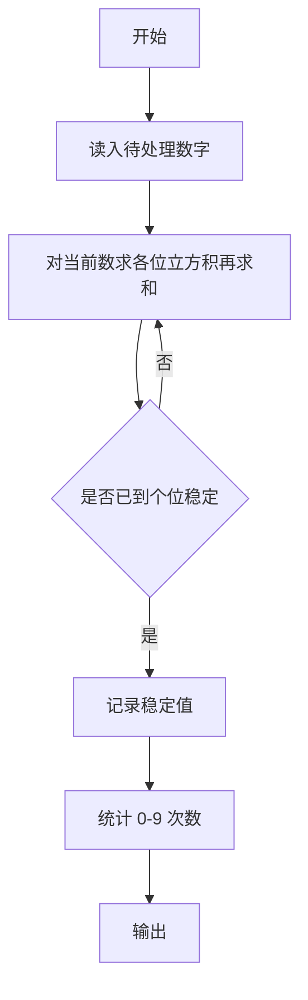
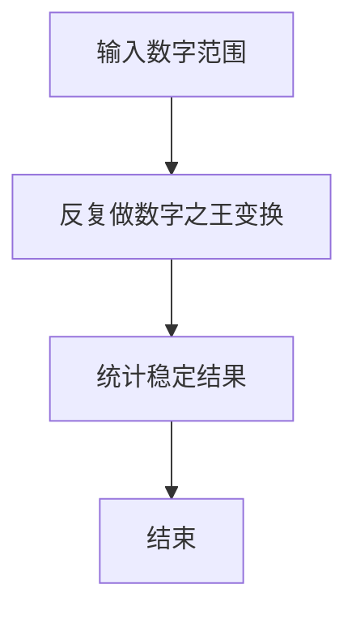

# 1117 数字之王

- **分值：** 20分

### 题目描述

给定两个正整数 $N_1 < N_2$。把从 $N_1$ 到 $N_2$ 的每个数的各位数的立方相乘，再将结果的各位数求和，得到一批新的数字，再对这批新的数字重复上述操作，直到所有数字都是 1 位数为止。这时哪个数字最多，哪个就是“数字之王”。

例如 $N_1=1$ 和 $N_2=10$ 时，第一轮操作后得到 { 1, 8, 9, 10, 8, 9, 10, 8, 18, 0 }；第二轮操作后得到 { 1, 8, 18, 0, 8, 18, 0, 8, 8, 0 }；第三轮操作后得到 { 1, 8, 8, 0, 8, 8, 0, 8, 8, 0 }。所以数字之王就是 8。

本题就请你对任意给定的 $N_1 < N_2$ 求出对应的数字之王。

### 输入格式：

输入在第一行中给出两个正整数 $0<N_1 < N_2 \le 10^3$，其间以空格分隔。

### 输出格式：

首先在一行中输出数字之王的出现次数，随后第二行输出数字之王。例如对输入 `1 10` 就应该在两行中先后输出 `6` 和 `8`。如果有并列的数字之王，则按递增序输出。数字间以 1 个空格分隔，行首尾不得有多余空格。

### 输入样例：
```
10 14
```

### 输出样例：
```
2
0 8
```


### 解题思路

本题的核心是：重复执行各位数字立方积再求和的变换，直到稳定并统计数字出现次数。程序先读取题目输入，再按照上述规则完成数据处理，最后严格按照题目要求输出结果。实现时应优先根据题目约束选择合适的数据类型和数据结构，避免溢出或不必要的重复计算。

时间复杂度为 O((N2-N1)L)；空间复杂度取决于输入规模，主要用于保存题目数据和中间结果。

### 代码流程说明

1. 读入区间或序列。
2. 对每个数反复变换到个位稳定。
3. 统计 0-9 出现次数。

### 代码实现

```ruby
# 题目：1117-数字之王
# 实现原理：
# 本题的核心是：重复执行各位数字立方积再求和的变换，直到稳定并统计数字出现次数
# 时间复杂度为 O((N2-N1)L)；空间复杂度取决于输入规模，主要用于保存题目数据和中间结果。
# 代码步骤：
# 1. 读取输入并初始化必要的数据结构。
# 2. 按题意完成核心计算，处理边界情况。
# 3. 按题目要求格式化并输出结果。
#
lower, upper = STDIN.read.split.map(&:to_i)
counts = Array.new(10, 0)
transform = lambda do |number|
  product = number.digits.map { |digit| digit**3 }.inject(1, :*)
  product.digits.sum
end
(lower..upper).each do |number|
  current = number
  current = transform.call(current) while transform.call(current) != current
  counts[current] += 1 if current < 10
end
maximum = counts.max
puts maximum
puts counts.each_index.select { |i| counts[i] == maximum }.join(" ")
```

### 代码流程图



### 解题流程图



### 常见易错点

- 变换定义要与题面完全一致。
- 注意 0 与含 0 数字的乘积。
- 统计的是稳定后的个位。
