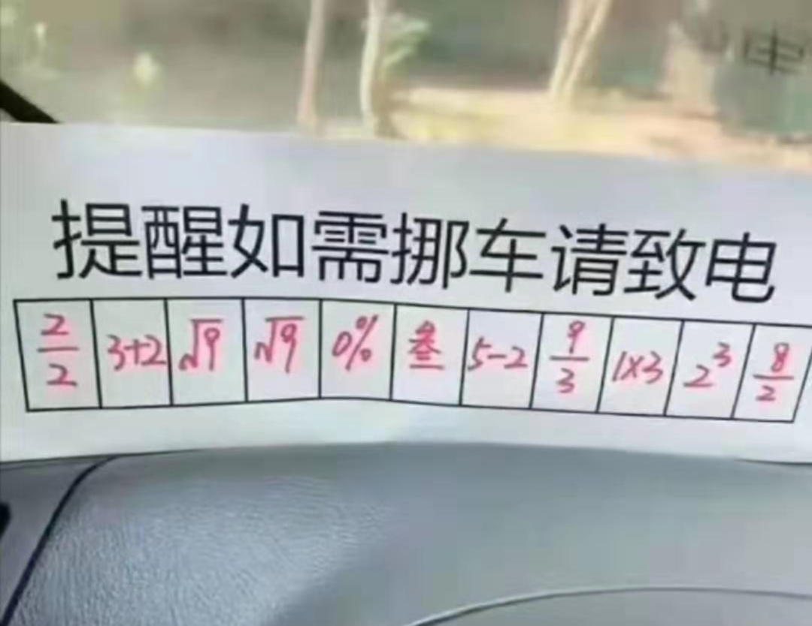
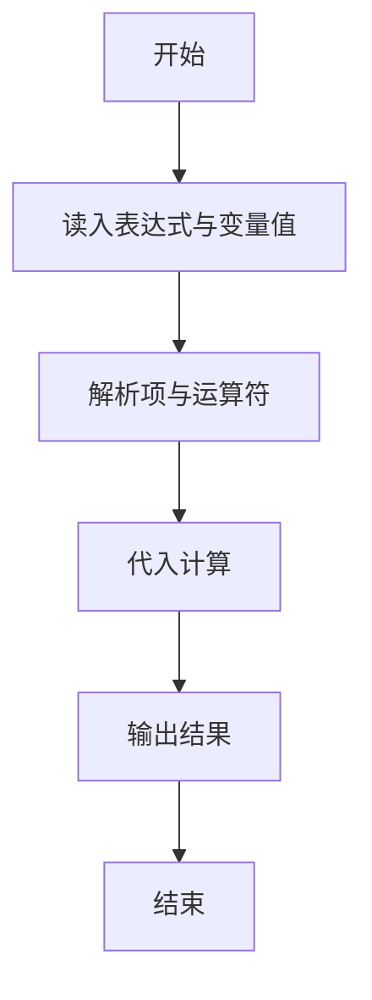
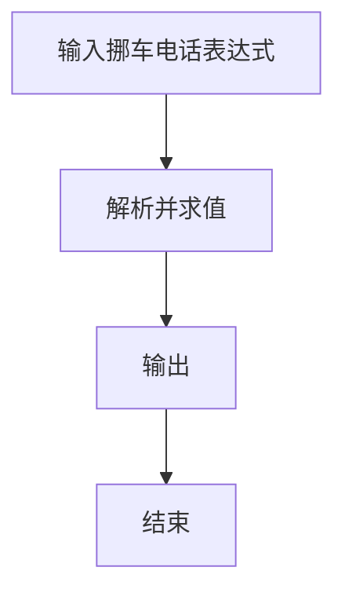

# 1118 如需挪车请致电

- **分值：** 20分

### 题目描述



上图转自新浪微博。车主用一系列简单计算给出了自己的电话号码，即：

$2/2=1$、$3+2=5$、$\sqrt {9} = 3$、$\sqrt {9} = 3$、$0\% = 0$、叁$=3$、$5-2=3$、$9/3=3$、$1\times 3 = 3$、$2^3 = 8$、$8/2=4$，最后得到的电话号码就是 153 3033 3384。

本题就请你写个程序自动完成电话号码的转换，以帮助那些不会计算的人。

### 输入格式：

输入用 11 行依次给出 11 位数字的计算公式，每个公式占一行。这里仅考虑以下几种运算：加（`+`）、减（`-`）、乘（`*`）、除（`/`）、取余（`%`，注意这不是上图中的百分比）、开平方根号（`sqrt`）、指数（`^`）和文字（即 0 到 9 的全小写汉语拼音，如 `ling` 表示 0）。运算符与运算数之间无空格，运算数保证是不超过 1000 的非负整数。题目保证每个计算至多只有 1 个运算符，结果都是 1 位整数。

### 输出格式：

在一行中给出电话号码，数字间不要空格。

### 输入样例：
```
2/2
3+2
sqrt9
sqrt9
6%2
san
5-2
9/3
1*3
2^3
8/2
```

### 输出样例：
```
15330333384
```


### 解题思路

本题的核心是：扫描表达式并按运算符切分，解析系数、变量和指数后计算目标值。程序先读取题目输入，再按照上述规则完成数据处理，最后严格按照题目要求输出结果。实现时应优先根据题目约束选择合适的数据类型和数据结构，避免溢出或不必要的重复计算。

时间复杂度为 O(L)；空间复杂度取决于输入规模，主要用于保存题目数据和中间结果。

### 代码流程说明

1. 读入表达式与变量值。
2. 解析多项式各项。
3. 代入计算并输出。

### 代码实现

```ruby
# 题目：1118-如需挪车请致电
# 实现原理：
# 本题的核心是：扫描表达式并按运算符切分，解析系数、变量和指数后计算目标值
# 时间复杂度为 O(L)；空间复杂度取决于输入规模，主要用于保存题目数据和中间结果。
# 代码步骤：
# 1. 读取输入并初始化必要的数据结构。
# 2. 按题意完成核心计算，处理边界情况。
# 3. 按题目要求格式化并输出结果。
#
tokens = STDIN.read.split
word_to_number = { "ling" => 0, "yi" => 1, "er" => 2, "san" => 3, "si" => 4, "wu" => 5, "liu" => 6, "qi" => 7, "ba" => 8, "jiu" => 9 }
parse = ->(value) { word_to_number.fetch(value, value.to_i) }
result = tokens.first(11).map do |expression|
  if expression.start_with?("sqrt")
    Math.sqrt(parse.call(expression[4..])).floor
  elsif word_to_number.key?(expression) || expression.match?(/\A[-+]?\d+\z/)
    parse.call(expression)
  else
    match = expression.match(/\A(.+?)([+\-*\/%^])(.+)\z/)
    left = parse.call(match[1])
    right = parse.call(match[3])
    { "+" => left + right, "-" => left - right, "*" => left * right, "/" => left / right, "%" => left % right, "^" => left**right }.fetch(match[2])
  end
end
puts result.map { |value| value % 10 }.join
```

### 代码流程图



### 解题流程图



### 常见易错点

- 解析系数默认 1、指数默认 1。
- 注意减号与负系数。
- 输出整数或按题面格式。
