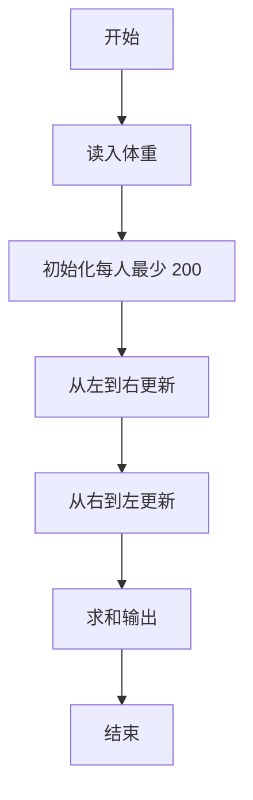
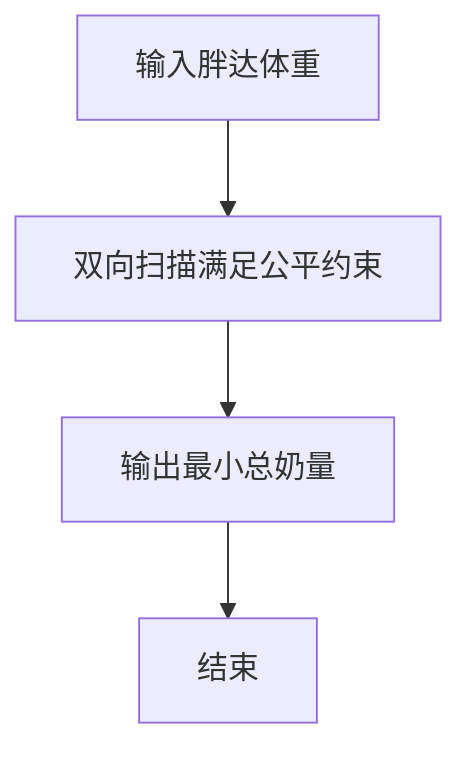

# 1119 胖达与盆盆奶

- **分值：** 20分

### 题目描述


大熊猫，俗称“胖达”，会排队吃盆盆奶。它们能和谐吃奶的前提，是它们认为盆盆奶的分配是“公平”的，即：更胖的胖达能吃到更多的奶，等胖的胖达得吃到一样多的奶。另一方面，因为它们是排好队的，所以每只胖达只能看到身边胖达的奶有多少，如果觉得不公平就会抢旁边小伙伴的奶吃。

已知一只胖达每次最少要吃 200 毫升的奶，当另一份盆盆奶多出至少 100 毫升的时候，它们才能感觉到是“更多”了，否则没感觉。

现在给定一排胖达的体重，请你帮饲养员计算一下，在保持给定队形的前提下，至少应该准备多少毫升的盆盆奶？

### 输入格式：

输入首先在第一行给出正整数 $n$（$\le 10^4$），为胖达的个数。随后一行给出 $n$ 个正整数，表示 $n$ 只胖达的体重（公斤）。每个数值是不超过 200 的正整数，数字间以空格分隔。

### 输出格式：

在一行中输出至少应该准备多少毫升的盆盆奶。

### 输入样例：
```
10
180 160 100 150 145 142 138 138 138 140
```

### 输出样例：
```
3000
```

### 样例解释

盆盆奶的分配量顺序为：

```
400 300 200 500 400 300 200 200 200 300
```


### 解题思路

本题的核心是：先从左到右满足体重递增约束，再从右到左补足另一侧约束，最后累加奶量。程序先读取题目输入，再按照上述规则完成数据处理，最后严格按照题目要求输出结果。实现时应优先根据题目约束选择合适的数据类型和数据结构，避免溢出或不必要的重复计算。

时间复杂度为 O(n)；空间复杂度取决于输入规模，主要用于保存题目数据和中间结果。

### 代码流程说明

1. 读入体重序列。
2. 正向反向各扫一遍更新奶量下限。
3. 累加输出总奶量。

### 代码实现

```ruby
# 题目：1119-胖达与盆盆奶
# 实现原理：
# 本题的核心是：先从左到右满足体重递增约束，再从右到左补足另一侧约束，最后累加奶量
# 时间复杂度为 O(n)；空间复杂度取决于输入规模，主要用于保存题目数据和中间结果。
# 代码步骤：
# 1. 读取输入并初始化必要的数据结构。
# 2. 按题意完成核心计算，处理边界情况。
# 3. 按题目要求格式化并输出结果。
#
tokens = STDIN.read.split.map(&:to_i)
count = tokens.shift
weights = tokens.first(count)
milk = Array.new(count, 200)
1.upto(count - 1) { |i| milk[i] = milk[i - 1] + 100 if weights[i] > weights[i - 1] }
(count - 2).downto(0) { |i| milk[i] = milk[i + 1] + 100 if weights[i] > weights[i + 1] && milk[i] <= milk[i + 1] }
puts milk.sum
```

### 代码流程图



### 解题流程图



### 常见易错点

- 差值至少 100 才算“更多”。
- 每人最少 200。
- 两个方向的约束都要满足。
