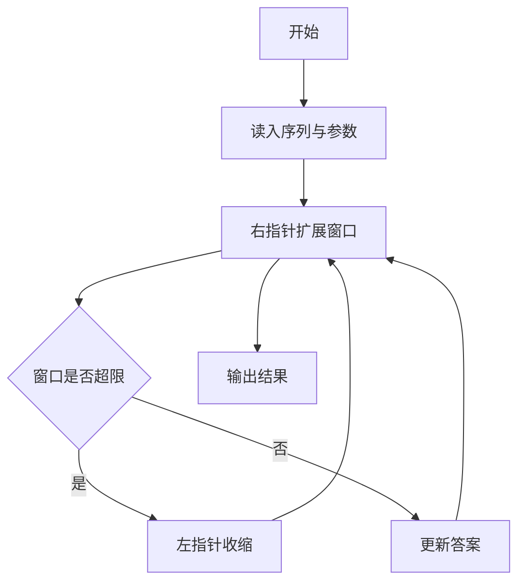
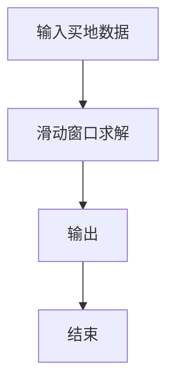

# 1120 买地攻略

- **分值：** 25分

### 题目描述

数码城市有土地出售。待售的土地被划分成若干块，每一块标有一个价格。这里假设每块土地只有两块相邻的土地，除了开头和结尾的两块是只有一块邻居的。每位客户可以购买多块连续相邻的土地。

现给定这一系列土地的标价，请你编写程序，根据客户手头的现金量，告诉客户有多少种不同的购买方案。

### 输入格式：

输入首先在第一行给出两个正整数：$N$（$\le 10^4$）为土地分割的块数（于是这些块从 1 到 $N$ 顺次编号）；$M$（$\le 10^9$）为客户手中的现金量。

随后一行给出 $N$ 个正整数，其中第 $i$ 个数字就是第 $i$ 块土地的标价。

题目保证所有土地的总价不超过 $10^9$。

### 输出格式：

在一行中输出客户有多少种不同的购买方案。请注意客户只能购买连续相邻的土地。

### 输入样例：
```
5 85
38 42 15 24 9
```

### 输出样例：
```
11
```

### 样例解释

这 11 种不同的方案为：

```
38
42
15
24
9
38 42
42 15
42 15 24
15 24
15 24 9
24 9
```


### 解题思路

本题的核心是：使用滑动窗口维护连续子数组和，窗口过大时从左侧移除元素。程序先读取题目输入，再按照上述规则完成数据处理，最后严格按照题目要求输出结果。实现时应优先根据题目约束选择合适的数据类型和数据结构，避免溢出或不必要的重复计算。

时间复杂度为 O(n)；空间复杂度取决于输入规模，主要用于保存题目数据和中间结果。

### 代码流程说明

1. 读入序列与窗口限制。
2. 双指针维护窗口和。
3. 记录满足条件的最优解并输出。

### 代码实现

```ruby
# 题目：1120-买地攻略
# 实现原理：
# 本题的核心是：使用滑动窗口维护连续子数组和，窗口过大时从左侧移除元素
# 时间复杂度为 O(n)；空间复杂度取决于输入规模，主要用于保存题目数据和中间结果。
# 代码步骤：
# 1. 读取输入并初始化必要的数据结构。
# 2. 按题意完成核心计算，处理边界情况。
# 3. 按题目要求格式化并输出结果。
#
tokens = STDIN.read.split.map(&:to_i)
count, budget = tokens.shift(2)
values = tokens.first(count)
left = 0
sum = 0
answer = 0
values.each_with_index do |value, right|
  sum += value
  while sum > budget
    sum -= values[left]
    left += 1
  end
  answer += right - left + 1
end
puts answer
```

### 代码流程图



### 解题流程图



### 常见易错点

- 窗口边界开闭要与题面一致。
- 答案初始化要合理。
- 注意全负/全正边界。
