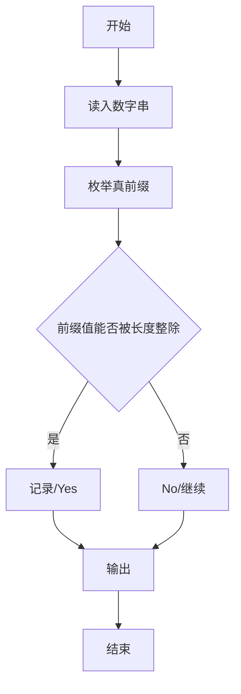
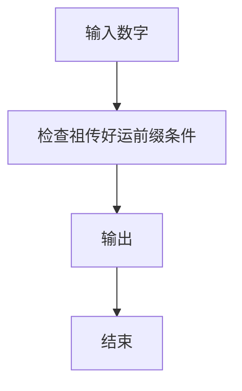

# 1121 祖传好运

- **分值：** 15分

### 题目描述

我们首先定义 0 到 9 都是**好运数**，然后从某个好运数开始，持续在其右边添加数字，形成新的数字。我们称一个大于 9 的数字 $N$ 具有**祖传好运**，如果它是由某个好运数添加了一个个位数字得到的，并且它能被自己的位数整除。

例如 123 就是一个祖传好运数。首先因为 1 是一个好运数的老祖宗，添加了 2 以后，形成的 12 能被其位数 2 （即 12 是一个 2 位数）整除，所以 12 是一个祖传好运数；在 12 后面添加了 3 以后，形成的 123 能被其位数 3 整除，所以 123 是一个祖传好运数。

本题就请你判断一个给定的正整数 $N$ 是不是具有祖传的好运。

### 输入格式：

每个输入包含 1 个测试用例。每个测试用例第 1 行给出正整数 $K$（$K\le 1000$）；第 2 行给出 $K$ 个不超过 $10^9$ 的待评测的正整数，注意这些数字都保证没有多余的前导零。

### 输出格式：

对每个待评测的数字，在一行中输出 `Yes` 如果它是一个祖传好运数，如果不是则输出 `No`。

### 输入样例：
```
5
123 7 43 2333 56160
```

### 输出样例：
```
Yes
Yes
No
No
Yes
```


### 解题思路

本题的核心是：逐个检查数字的所有真前缀，判断每个前缀是否能被对应长度整除。程序先读取题目输入，再按照上述规则完成数据处理，最后严格按照题目要求输出结果。实现时应优先根据题目约束选择合适的数据类型和数据结构，避免溢出或不必要的重复计算。

时间复杂度为 O(L²)；空间复杂度取决于输入规模，主要用于保存题目数据和中间结果。

### 代码流程说明

1. 读入数字串。
2. 枚举每个真前缀。
3. 判断前缀数值能否被前缀长度整除，输出结果。

### 代码实现

```ruby
# 题目：1121-祖传好运
# 实现原理：
# 本题的核心是：逐个检查数字的所有真前缀，判断每个前缀是否能被对应长度整除
# 时间复杂度为 O(L²)；空间复杂度取决于输入规模，主要用于保存题目数据和中间结果。
# 代码步骤：
# 1. 读取输入并初始化必要的数据结构。
# 2. 按题意完成核心计算，处理边界情况。
# 3. 按题目要求格式化并输出结果。
#
tokens = STDIN.read.split
count = tokens.shift.to_i
tokens.first(count).each do |text|
  value = 0
  valid = true
  text.each_char.with_index do |char, index|
    value = value * 10 + char.to_i
    valid = false unless (value % (index + 1)).zero?
  end
  puts valid ? "Yes" : "No"
end
```

### 代码流程图



### 解题流程图



### 常见易错点

- 真前缀不包含整个数字串（若题面如此）。
- 前缀按数值判断，但长度是位数。
- 前导零前缀的处理。
