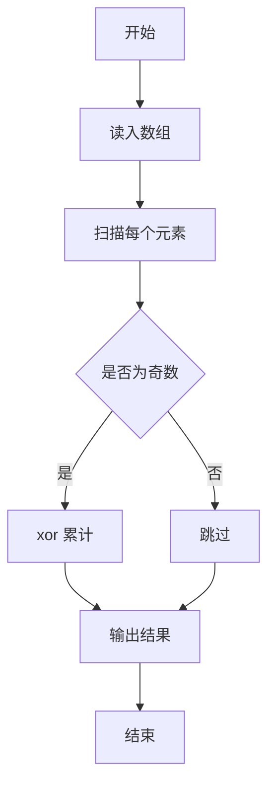
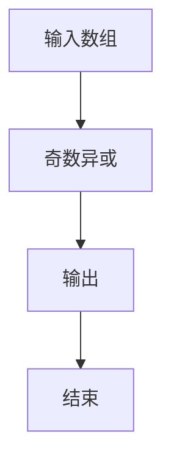

# 1122 找奇葩

- **分值：** 20分

### 题目描述

在一个长度为 $n$ 的正整数序列中，所有的奇数都出现了偶数次，只有一个奇葩奇数出现了奇数次。你的任务就是找出这个奇葩。

### 输入格式：

输入首先在第一行给出一个正整数 $n$（$\le 10^4$），随后一行给出 $n$ 个满足题面描述的正整数。每个数值不超过 $10^5$，数字间以空格分隔。

### 输出格式：

在一行中输出那个奇葩数。题目保证这个奇葩是存在的。

### 输入样例：
```
12
23 16 87 233 87 16 87 233 23 87 233 16
```

### 输出样例：
```
233
```


### 解题思路

本题的核心是：扫描数组，对奇数元素执行异或，偶数元素不参与运算。程序先读取题目输入，再按照上述规则完成数据处理，最后严格按照题目要求输出结果。实现时应优先根据题目约束选择合适的数据类型和数据结构，避免溢出或不必要的重复计算。

时间复杂度为 O(n)；空间复杂度取决于输入规模，主要用于保存题目数据和中间结果。

### 代码流程说明

1. 读入数组。
2. 将奇数元素异或起来。
3. 输出结果。

### 代码实现

```ruby
# 题目：1122-找奇葩
# 实现原理：
# 本题的核心是：扫描数组，对奇数元素执行异或，偶数元素不参与运算
# 时间复杂度为 O(n)；空间复杂度取决于输入规模，主要用于保存题目数据和中间结果。
# 代码步骤：
# 1. 读取输入并初始化必要的数据结构。
# 2. 按题意完成核心计算，处理边界情况。
# 3. 按题目要求格式化并输出结果。
#
tokens = STDIN.read.split.map(&:to_i)
count = tokens.shift
answer = tokens.first(count).select(&:odd?).inject(0, :^)
puts answer
```

### 代码流程图



### 解题流程图



### 常见易错点

- 偶数不参与。
- 初始异或值为 0。
- 负数奇偶按绝对值或语言定义，以题面为准。
