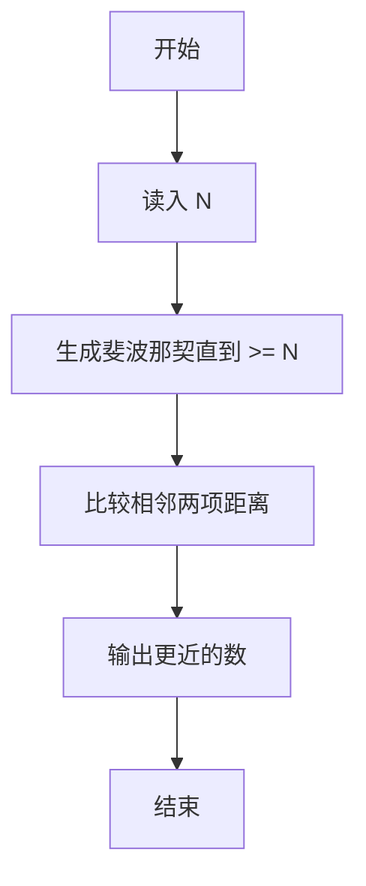
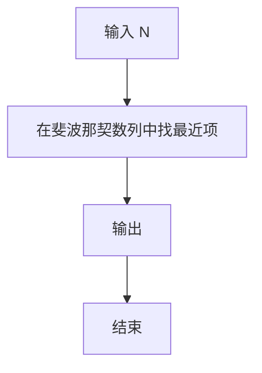

# 1124 最近的斐波那契数

- **分值：** 20分

### 题目描述

**斐波那契数列** $F_n$ 的定义为：对 $n\ge 0$ 有 $F_{n+2} = F_{n+1} + F_n$，初始值为 $F_0 = 0$ 和 $F_1 = 1$。所谓与给定的整数 $N$ **最近的斐波那契数**是指与 $N$ 的差之绝对值最小的斐波那契数。

本题就请你为任意给定的整数 $N$ 找出与之最近的斐波那契数。

### 输入格式：

输入在一行中给出一个正整数 $N$（$\le 10^8$）。

### 输出格式：

在一行输出与 $N$ 最近的斐波那契数。如果解不唯一，输出最小的那个数。

### 输入样例：
```
305
```

### 输出样例：
```
233
```

### 样例解释

部分斐波那契数列为 { 0, 1, 1, 2, 3, 5, 8, 13, 21, 34, 55, 89, 144, 233, 377, 610, ... }。可见 233 和 377 到 305 的距离都是最小值 72，则应输出较小的那个解。
<br/>
**感谢 江月 指出的题面错误！已于 25.3.13 修改。**


### 解题思路

本题的核心是：生成递增的斐波那契数列，比较给定 N 与相邻两项的距离并选择较近者。程序先读取题目输入，再按照上述规则完成数据处理，最后严格按照题目要求输出结果。实现时应优先根据题目约束选择合适的数据类型和数据结构，避免溢出或不必要的重复计算。

时间复杂度为 O(log N)；空间复杂度取决于输入规模，主要用于保存题目数据和中间结果。

### 代码流程说明

1. 读入 N。
2. 生成斐波那契数直到覆盖 N。
3. 输出距离 N 更近的项（平局取较小）。

### 代码实现

```ruby
# 题目：1124-最近的斐波那契数
# 实现原理：
# 本题的核心是：生成递增的斐波那契数列，比较给定 N 与相邻两项的距离并选择较近者
# 时间复杂度为 O(log N)；空间复杂度取决于输入规模，主要用于保存题目数据和中间结果。
# 代码步骤：
# 1. 读取输入并初始化必要的数据结构。
# 2. 按题意完成核心计算，处理边界情况。
# 3. 按题目要求格式化并输出结果。
#
number = STDIN.read.to_i
lower = 0
upper = 1
while upper < number
  lower, upper = upper, lower + upper
end
puts number - lower <= upper - number ? lower : upper
```

### 代码流程图



### 解题流程图



### 常见易错点

- 距离相等时按题面取较小。
- 数列从 1,1 或 1,2 开始要与题面一致。
- N 很大时用递推。
