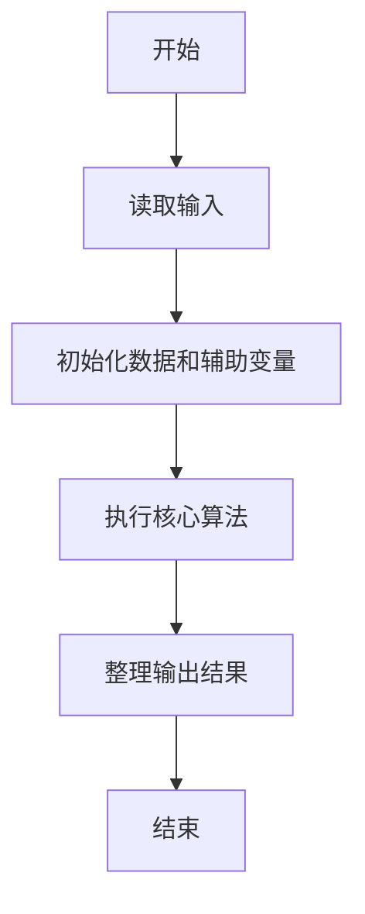
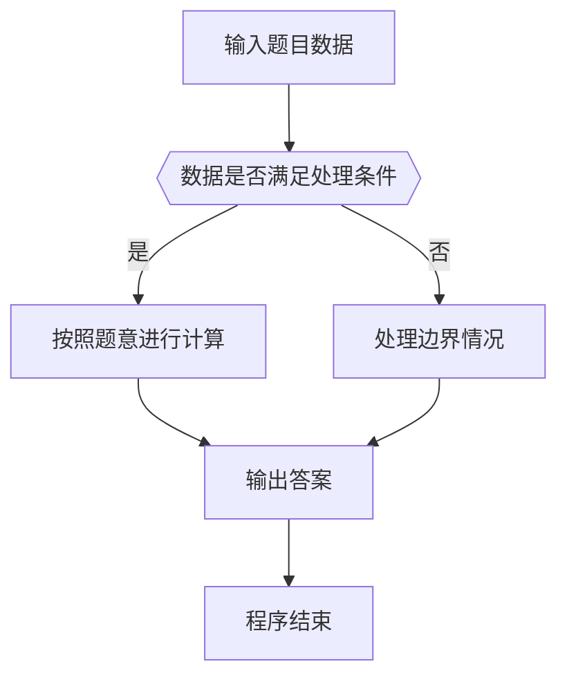

# 1125 子串与子列

- **分值：** 25分

### 题目描述

**子串**是一个字符串中连续的一部分，而**子列**是字符串中保持字符顺序的一个子集，可以连续也可以不连续。例如给定字符串 `atpaaabpabtt`，`pabt`是一个子串，而 `pat` 就是一个子列。

现给定一个字符串 $S$ 和一个子列 $P$，本题就请你找到 $S$ 中包含 $P$ 的最短子串。若解不唯一，则输出起点最靠左边的解。

### 输入格式：

输入在第一行中给出字符串 $S$，第二行给出 $P$。$S$ 非空，由不超过 $10^4$ 个小写英文字母组成；$P$ 保证是 $S$ 的一个非空子列。

### 输出格式：

在一行中输出 $S$ 中包含 $P$ 的最短子串。若解不唯一，则输出起点最靠左边的解。

### 输入样例：
```
atpaaabpabttpcat
pat
```

### 输出样例：
```
pabt
```


### 解题思路

本题的核心是：用动态规划记录子列 P 各前缀的最早匹配位置，找到包含 P 的最短连续子串。程序先读取题目输入，再按照上述规则完成数据处理，最后严格按照题目要求输出结果。实现时应优先根据题目约束选择合适的数据类型和数据结构，避免溢出或不必要的重复计算。

时间复杂度为 O(|S||P|)；空间复杂度取决于输入规模，主要用于保存题目数据和中间结果。

### 代码流程说明

1. 读取 1125 子串与子列 所需的输入数据。
2. 初始化计数器、数组或其他辅助变量。
3. 用动态规划记录子列 P 各前缀的最早匹配位置，找到包含 P 的最短连续子串。
4. 按题目规定的格式输出计算结果。

### 代码实现

```ruby
# 题目：1125-子串与子列
# 实现原理：
# 本题的核心是：用动态规划记录子列 P 各前缀的最早匹配位置，找到包含 P 的最短连续子串。程序先读取题目输入，再按照上述规则完成数据处理，最后严格按照题目要求输出结果。实现时应优先根据题目约束选择合适的数据类型和数据结构，避免溢出或不必要的重复计算。
# 时间复杂度为 O(|S||P|)；空间复杂度取决于输入规模，主要用于保存题目数据和中间结果。
# 代码步骤：
# 1. 读取输入并初始化必要的数据结构。
# 2. 按题意完成核心计算，处理边界情况。
# 3. 按题目要求格式化并输出结果。
#
source, pattern = STDIN.read.split
best = nil
(0...source.length).each do |start|
  pattern_index = 0
  (start...source.length).each do |finish|
    pattern_index += 1 if pattern_index < pattern.length && source[finish] == pattern[pattern_index]
    next unless pattern_index == pattern.length
    candidate = source[start..finish]
    best = candidate if best.nil? || candidate.length < best.length
    break
  end
end
puts best
```

### 代码流程图



### 解题流程图



### 常见易错点

- 注意输入数据的范围，选择足够大的整数类型，并正确处理边界值。
- 循环、数组下标和字符串结束位置要严格对应题目定义，避免越界。
- 输出格式必须与题目要求完全一致，包括空格、换行、大小写和特殊符号。
- 如果存在排序、去重、进位、约分或四舍五入等操作，应在输出前统一完成。
